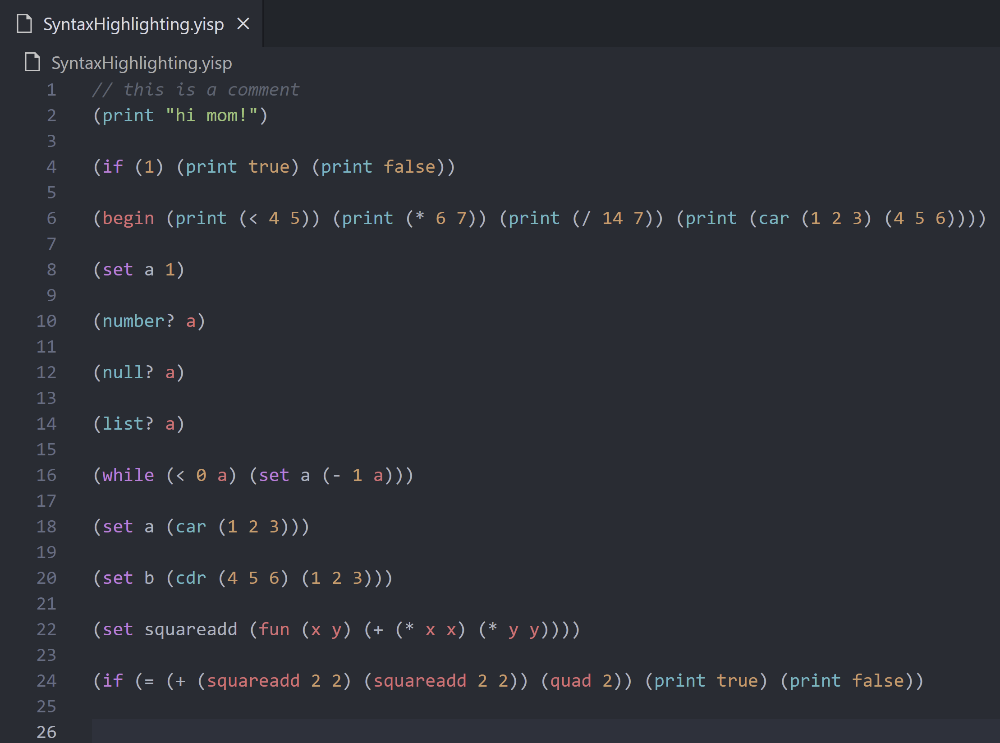

# YISP Language

Syntax highlighting for the YISP Language.

## What is YISP?

YISP is a general purpose language designed to add significant functionality to the existing language interpreted in CS403, Lisp. It also takes inspiration from Clojure. It was designed by Utsav Basu, Rollins Baird, and Thomas Hampton.

## What is YISP Language

This additions to Lisp added by YISP provides functionality that turns Lisp from a classroom-language to a language that can be used for more intricate designs. YISP incorporates functional programming concepts that allow for more precise, less error-prone, efficient code that cuts out syntactic sugar. Vector and hash map support allow YISP programmers to store data in more efficient ways, simplifying projects that would otherwise be complex in Lisp. The ability to access command history helps the programmer be more efficient.

## Build Instructions

To build, navigate to the root directory and run `vsce package`. This will create a `.vsix` file which can be imported to VSCode.
